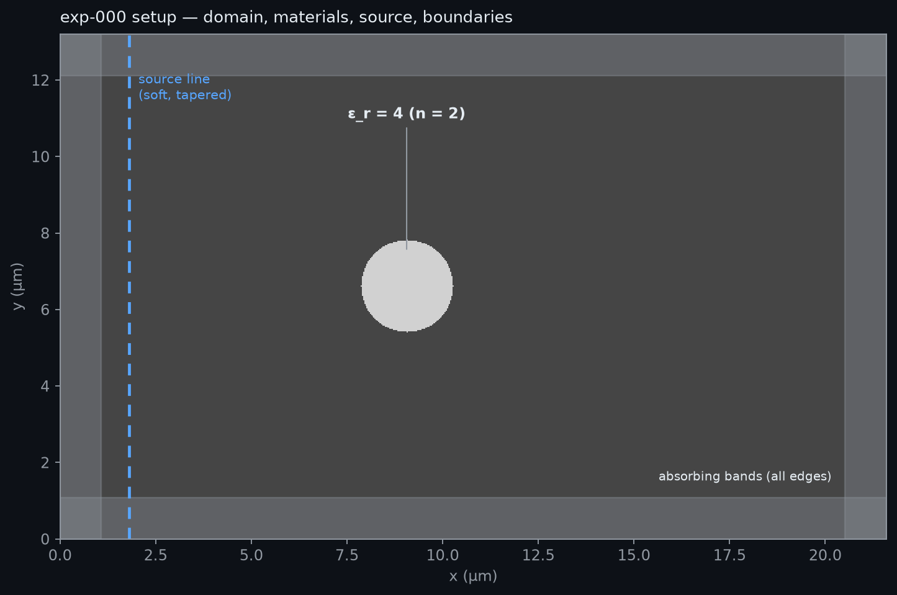
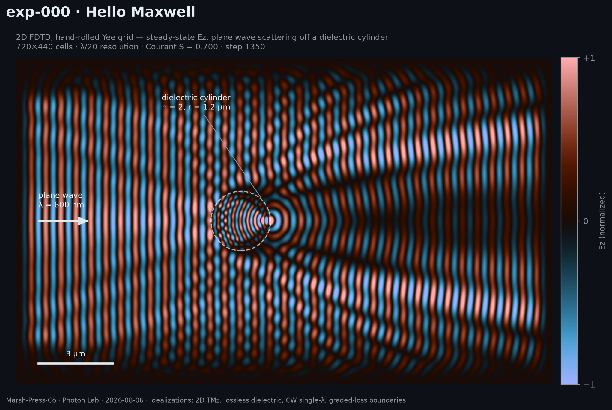
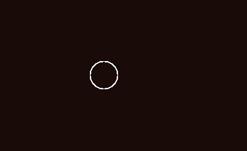

# exp-000 — Hello Maxwell

**2026-08-06 · driver: Clyde · status: 🟢 green**

Plane wave meets dielectric cylinder, solved by a hand-rolled 2D FDTD engine —
no solver library, ~40 lines of core physics in plain numpy. This is the
"first light" experiment: if the textbook features appear and the numbers
check, the bench is real and everything after it stands on validated ground.

## Hypothesis

A Yee-grid FDTD solver written from scratch will reproduce textbook
scattering: wavelength compression inside the dielectric (n = 2 → λ/2), a
shadow behind the cylinder, an interference wake, and backscatter standing
waves upstream. Quantitatively: the propagated wavelength should measure
within ~1% of the wavelength we set.

## Setup

| Parameter | Value |
|---|---|
| Wavelength λ | 600 nm (flashlight-ish visible) |
| Resolution | 20 cells/λ → dx = 30 nm |
| Domain | 720 × 440 cells = 21.6 × 13.2 µm (36λ × 22λ) |
| Cylinder | r = 1.2 µm = 2λ, ε_r = 4 (n = 2), lossless |
| Time | 1400 steps, Courant S = 0.700 (2D limit 1/√2) |
| Source | soft line source, raised-cosine turn-on, tapered ends |
| Boundaries | graded-loss absorbing bands, 36 cells, cubic ramp |
| Solver | TMz Yee grid: Ez, Hx, Hy — leapfrog in time, staggered in space |
| Runtime | ~17 s (plain numpy, consumer laptop) |

**Idealizations** (per lab convention, stated up front):

- 2D — an infinite cylinder, not a sphere; TMz polarization only
- single CW wavelength, lossless non-dispersive material
- soft line source, not a TF/SF injector → slight wavefront curvature near
  the domain edges; total field shown (no incident/scattered separation)
- graded-loss bands, not true PML → ~1% residual edge reflection

## Result

Self-checks (printed by `run.py`):

| Check | Result |
|---|---|
| Stability | max\|Ez\| = 2.50, finite and bounded over 1400 steps ✓ |
| Wavelength | set 20.0 cells (600 nm), **measured 20.0 cells (600 nm)** by FFT of a quiet strip ✓ |
| Shadow | time-averaged intensity behind cylinder / reference = **0.48** ✓ |

Everything the textbook promises is in the picture:

- **λ/2 inside the cylinder** — the fringes visibly double in density where
  n = 2. Light slows down in glass; the solver knew without being told.
- **A bright focus at the exit face** — that concentrated spot is a
  **photonic nanojet**, a real published phenomenon (Chen, Taflove &
  Backman, *Opt. Express* 2004) that wavelength-scale dielectric cylinders
  produce. We did not design for it; it showed up because the physics does.
  The max\|Ez\| = 2.5 hot spot in the stability check is this focus.
- **Two-lobe interference wake** fanning downstream — coherent diffraction,
  not a simple geometric shadow.
- **Backscatter ripple upstream** — reflected light interfering with the
  incoming wave.

## What we learned

- Maxwell in 2D is three arrays and two update rules. Yee's 1966 trick —
  stagger E and H half a cell apart in space and half a step in time — is
  what makes the leapfrog stable, and it's the same core inside every
  production FDTD code.
- The shadow is **0.48, not 0** — diffraction puts light back behind a
  2.4 µm object. In coherent light, wavelength-scale things don't cast dark
  shadows. First data point for this lab's real theme: *invisibility is a
  spectrum, and the wave always finds a way around.*
- Absorbing boundaries are the genuinely hard part of FDTD. Our graded-loss
  bands are the simple version; true PML is worth building as a `lab/`
  utility when an experiment needs cleaner edges.

## Next

- **exp-001 — The Flashlight Statement**: same beam, three objects
  (reflector / ultra-absorber / transformation-optics cloak); render what an
  observer at the source sees. The founding experiment.
- **Bench cross-validation**: run this exact scene through `ceviche` (FDFD)
  and flaport's `fdtd` — three independent solvers agreeing on one scene
  makes the whole bench trustworthy, not just this script. (Both libraries
  import-verified on Python 3.14 at kickoff.)
- Parking lot (v2): TF/SF plane-wave injector, true PML, scattering
  cross-section machinery (that's exp-002's metric).
