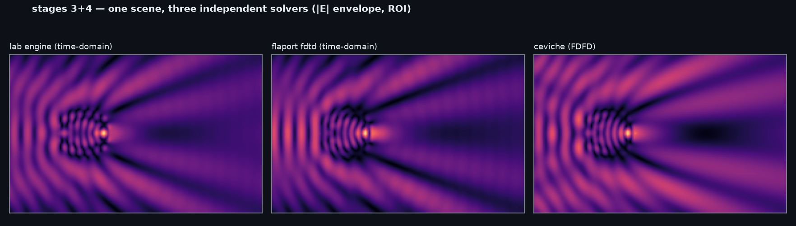
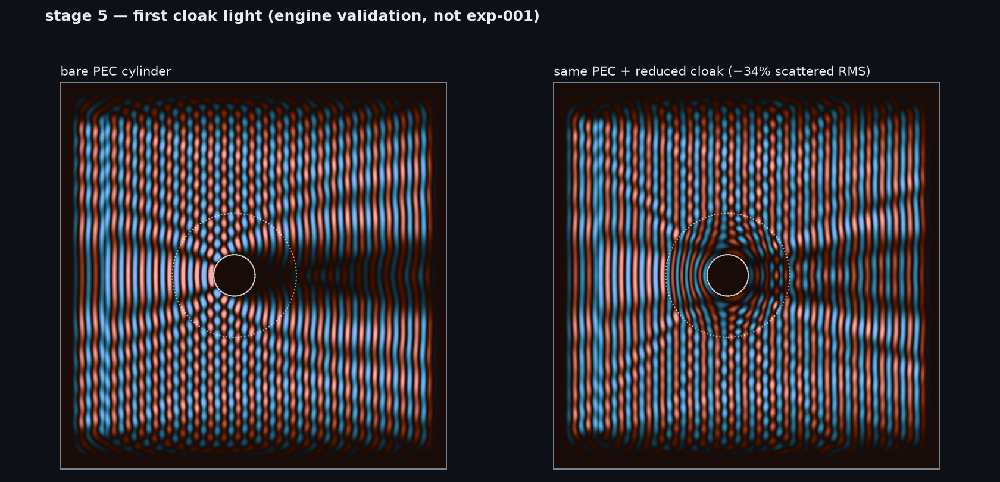

# Bench validation — lab/ engine trust suite

**2026-08-19 · driver: Clyde (panel Iteration 23, Phase-5 mandatory-fix close)
· status: 🟢 89/89 checks green** (`--only 12346789,10,11,12,13,14,15`
[82/82] + `--only 16` [5/5] + `--only 5` [2/2], ubuntu cloud bench, python
3.11.15 / numpy 2.4.6)

Stage 16 (oblique Gaussian line source) added with exp-046 — the first
trust-gating of `add_line_source(profile="gauss")`, an engine path declared
in `lab/fdtd2d.py:152-156` since the bench was built and, grep-verified,
never once exercised or gated in this program's history until this cycle
tried to use it. Five gates (four FDTD, one desk-only) on exp-041/042's own committed geometry: the
free-space divergence identity w(z) = w₀√(1+(z/z_R)²) at three planes
(measured worst 1.06% of 3%), a beam-pointing gate, the plane-path absolute
regression anchor against exp-041's committed `C_empty(+40°,600nm)` =
−0.010964794540566314 (measured **6.96×10⁻¹⁵ relative** — restated as
relative with the platform named, Red Team docket 14: a 1400-step FDTD
bit-reproducibility claim that does not name its platform is not a gate),
and the **oblique-width gate**: `width = w₀/cos θ₀ = 56.063` at θ₀=40°
must put the 1/e² half-width at `PLANE_X` on 79.47 cells — measured 80.47,
**1.25%**, against a 5% bar. That last one is the stage's reason to exist:
gates (a) and (b) cannot fail on the defect this cycle actually had (a
source width of w₀ where the physics requires w₀/cos θ₀ — the same run at
the wrong width reads 87.25 against a 79.47 target, 9.8% off), and Red
Team's own independent FDTD run of the same configuration measured 80.47
before this stage existed, reproduced here to four significant figures on a
different code path.

**Gate amended on first light, then REPOINTED at Phase 5 (stage 16b) —
both steps on the record.** The pointing gate as proposed scored the beam
centre against RAY OPTICS (`y_c + D_SP·tan40` = 979.12) to ±2 cells, and
failed on first light at 992.09. That the failure is in the target, not the
engine, stands: at this gate's own `width=40` the emitted divergence is
14.0° FWHM, where `k_y = k·sin θ` is measurably nonlinear.

**But the first-light amendment's replacement comparator was itself
physically wrong** (Panel Iteration 23 Phase-5 Red Team audit, docket item
1, applied this shift). It propagated the aperture as a prescribed FIELD and
reduced it with `|E|²`, where this bench impresses a line CURRENT
(`fdtd2d.py:232-237`, so the radiated spectrum carries an extra `1/k_x`) and
`ambient.observer_profile` reads a FLUX (`+½Re(E_z·conj(H_y))`, obliquity
`k_x/k` entering once via H, not squared via E). Two missing obliquities in
opposite directions, and they do not cancel — the same error species this
program adjudicated at Iteration 19 (LOGBOOK T21), now its fourth appearance
and its first inside `lab/`. Corrected comparator: **991.675** (vs 987.14
shipped), FDTD **992.093** → the engine's true pointing error is **0.418
cells = 0.459% of the beam half-width**, not 5.4%. Consequences, both fixed:
the 8% bar was **~17× too loose** (a ~7-cell pointing regression would have
passed), and at Block A's own extreme cell (`width`=28.03, FWHM=20°, θ₀=40°)
the shipped comparator read 994.223 against an FDTD 1005.549 — **9.38%
against its own 8% bar, i.e. it would have FAILED and blamed a solver whose
true error there is 0.38%**. Repointed and **re-barred at ≤1.5%** of the beam
half-width (measured 0.46%, 3× margin, stage 10's convention). The
ray-optics reading and a PEAK-estimator comparison (exact 976.54 / FDTD peak
cell 977.0 / ray optics 979.12 = 2.58 cells — a stationary-phase ray is what
ray optics actually predicts, so only ~2.6 of the 13 cells is genuine
non-paraxial target error) stay as `[info]` lines. exp-046's own `run.py`
scores the ORIGINAL, unamended gate and records it as FAILED — the
pre-registered prediction is not retro-fitted there, only the suite's
forward-looking gate is repaired.

**New gate 16b2, desk-only, mandatory acceptance test for the repoint:** the
corrected comparator must reproduce an INDEPENDENT second derivation by a
different route — a real-space Rayleigh–Sommerfeld/Huygens sum with the
obliquity on H (exp-042's own `_G0_for` + `field_and_h` recipe, re-derived
from geometry inside the suite so no experiment directory is imported).
Measured **0.030 cells** in centre and **0.011 cells** in half-width
(991.675/91.587 vs 991.645/91.576), bar ≤0.1 cells. This gate exists because
of the standing rule adopted the same shift: *a post-freeze change to a trust
gate's TARGET — as opposed to its bar or its reporting — is a physics change
and requires an independent second derivation, from a different route, before
it is committed.*

**`--only` wiring fixed, third recurrence of one bug species** (Iteration
15's digit-substring collision, Iteration 17's incomplete fix, and now
this): a LONE multi-digit token was still passed through the single-digit
substring test, so `--only 16` selected stages 1 and 6 as well as 16, and
`--only 12` — cited in SESSION_LOG as "stage 12 alone, 5/5" — actually
fired stages 1, 2 and 12. Iteration 17's own mixed-idiom fix also dropped
packed tokens entirely in a mixed invocation: `--only 12346789,10,11`
selected only stages 10 and 11. The rule now: each token is EITHER an exact
stage id (selects exactly that stage) OR a legacy packed digit run
(single-digit stages match as substrings, multi-digit on digit boundaries);
tokens compose. Verified by direct execution against every `--only` citation
in this program's history.

**Erratum on the erratum (Red Team docket item 12, same shift).** The
packed-token regression is real but its blast radius was over-claimed here:
the exact-match rule that caused it landed at commit **`6082e02`,
2026-08-17**, and **no `--only` citation in this program's published history
postdates it**. Running the pre-`6082e02` `_stage_selected` against
`--only 12346789,10,11` selects `{1,2,3,4,6,7,8,9,10,11}` — the intended ten
stages. All five SESSION_LOG citations of that invocation (lines
1026/1155/1253/1347/1455) sit under headers dated **2026-08-14/15**
(Iterations 7–11, exp-030/031/032/033/034) and were correct under the code in
force when they were run. The regression affects **post-2026-08-17
invocations only, of which none were ever cited.** The `--only 16 → {1,6,16}`
and `--only 12 → {1,2,12}` halves are correct as stated, and the fix itself
is right. Corrected before it reached LOGBOOK.

Stage 11 (multi-source coherent superposition gate) added with exp-029 —
the first suite check to exercise ≥2 concurrent sources in one `Sim`
(`Sim.sources` has always been a plain list summed by `run()`'s per-step
loop, but no check had ever exercised that end-to-end — Red Team's own
Iteration 5/6 ruling: the mechanical capability existing is not the
configuration being validated). Two absolute identities — a joint
two-source run's complex Ez phasor equals the pointwise sum of each
source's own single-source phasor, in vacuum (1.91×10⁻¹⁵) and with a
lossy object present (1.89×10⁻¹⁵, the σ_e branch, exercised with 2
concurrent sources for the first time) — both a machine-epsilon-scale
confirmation that superposition holds to float64 round-off, not merely
approximately, exactly as EM's/Red Team's line-by-line trace of
`Sim.run()`'s fixed linear update operators predicted. A third check
reuses stage 10's own empirical radial-ledger closure gate (≤1.5%) on the
two-source joint scene (measured 1.13%) — the same registration offset
stays source-count-independent, now confirmed on a spatially-interfering
field for the first time.

Stage 10 (radial-binned absorbed-power ledger) added with exp-028 —
`lab/sections.py::radial_absorbed_power`, the first spatially-resolved
absorption channel (Joule-dissipation density in concentric annuli from the
object's own captured field phasors), closing a structural blind spot the
box-ledger's net four-face flux identity has carried since exp-002 (it
cannot see WHERE inside the box absorbed power lands). Gated by a hard
PEC-core identity (Ez≡0 by the clamp, σ_e≡0 by construction — doubly
forced, machine-epsilon exact) and an empirical volume-vs-surface closure
against the box-ledger's own p_abs, calibrated on first run: measured
1.11–1.12%, stable to the 4th significant figure across a 4× settling-step
sweep (900/1800/3600) — confirmed settling-INDEPENDENT, a genuine small
registration offset between the box-ledger's rectangular-face flux
integral and the radial ledger's circular-disk mask (grid quantization of
a circle vs. a square), not incomplete CW settling. Gate set to ≤1.5%,
margin above the measured value. Not run by the fast `--only 12346789`
invocation (new/optional, like heavy stage 5) — explicit `--only ...,10`
needed; see Measurement lessons below.

Stage 9 (ambient-appearance instrument) added with exp-020 — the panel
program's constraint-3 metric (angled line source + `lab/ambient.py`:
incoherent multi-angle back-light, near-plane B(y), window Weber contrast).
Its absolute anchors: an exact Beer–Lambert half-plane slab (measured C
within 0.001 of theory) and the closed-box energy identities re-proven on
the oblique source path. One honest recalibration on first light, mechanism
recorded below: point-wise B(y) flatness is fringe-limited on a soft-source
bench; the gated quantity is the window mean.

Stage 8 (cross-section machinery) added with exp-002, and with it a
forensic catch: a phasor-convention bug in `lab/emit` whose signature was
stage 6's 1.25% "camera floor" (= sin²(ω/2) exactly). Post-fix: empty room
1e-4, Fresnel 0.1114 vs theory's 0.1111, mirror gate honestly recalibrated
to ≥ 0.90 (deficit = documented round-trip beam diffraction). Absolute
power balances expose what ratio-normalized gates cannot — recorded below.

Stage 6 (observer camera + emitter) added 2026-08-09 with the emitter
build; stage 7 (graded-black absorber vs pre-registered gates) added the
same day with the absorber design; stages 1–5 unchanged and re-verified.

The `lab/` engine grew out of exp-000 with what exp-001 needs: conductivity,
PEC regions, **anisotropic magnetic response** (2×2 inverse-μ tensor,
B-then-H scheme), profiled sources, and Poynting flux monitors. New physics
machinery = new ways to be wrong, so this suite is the gate: five stages,
hard expected numbers, exit 0 or it doesn't ship.

Run it:

    .venv\Scripts\python.exe lab\validation\run_all.py --only 1234
    .venv\Scripts\python.exe lab\validation\run_all.py --only 5

## Results

| # | Stage | Check | Result | Expected |
|---|---|---|---|---|
| 1 | regression | wavelength | 19.97 cells | 20.0 ± 0.2 |
| 1 | regression | peak \|Ez\| | 2.52 | 2.50 ± 0.15 |
| 1 | regression | shadow ratio | 0.479 | 0.48 ± 0.03 |
| 2 | impedance | ε=4, μ=1 → Fresnel | R = 0.098 | 0.111 ± 0.025 |
| 2 | impedance | ε=μ=4 matched (scalar path) | R = 0.018 | 0 ± 0.02 |
| 2 | impedance | μ_yy=4 matched (tensor path) | R = 0.018 | 0 ± 0.02 |
| 3 | fdtd-lib | scattered-pattern corr | 0.928 | ≥ 0.90 |
| 3 | fdtd-lib | wavelength | 20.37 cells | 20.0 ± 0.5 |
| 3 | fdtd-lib | shadow agreement | Δ = 0.047 | ≤ 0.10 |
| 4 | ceviche | scattered-pattern corr | 0.956 | ≥ 0.90 |
| 4 | ceviche | wavelength | 19.80 cells | 20.0 ± 0.5 |
| 5 | cloak | scattered RMS cloaked/bare | **0.657** | ≤ 0.75 |
| 5 | cloak | tensor run stable | max 3.37 | finite, < 50 |
| 6 | observer | empty room returns ~nothing | 0.0125 | < 0.02 |
| 6 | observer | mirror returns ~everything | 0.955 | 1.00 ± 0.05 |
| 6 | observer | half-space returns Fresnel 1/9 | **0.1075** | 0.111 ± 0.02 |
| 6 | observer | Fresnel return is specular | 0.99 in ±12° | ≥ 0.80 |
| 6 | emitter | save→load→validate round trip | OK | no exception |
| 7 | absorber | bare wall sanity (mirror) | R = 0.988 | ≥ 0.90 |
| 7 | absorber | coated wall @ 600 nm | **R = 0.0010** | ≤ 0.01 |
| 7 | absorber | coated wall @ 450 nm | R = −0.0002 | ≤ 0.02 |
| 7 | absorber | coated wall @ 750 nm | R = 0.0020 | ≤ 0.02 |
| 7 | absorber | sponge/PEC return, net of floor | **0.000** | ≤ 0.10 |
| — | ours-small | wavelength | 19.96 cells | 20.0 ± 0.2 |
| 9 | ambient | angle_deg=0 bit-exact vs legacy | 0.0 | 0.0 exactly |
| 9 | ambient | oblique wavelength @30° (20/cosθ) | 23.08 | 23.09 ± 0.4 |
| 9 | ambient | empty window balance @0° | −0.0004 | \|·\| ≤ 0.005 |
| 9 | ambient | empty window balance @±15° | −0.019 / +0.021 | \|·\| ≤ 0.04 |
| 9 | ambient | ripple canary @0° / ±15° | 0.130 / 0.325 | ≤ 0.25 / 0.50 |
| 9 | ambient | empty identity, summed \|C_empty\| | **0.00043** | ≤ 0.005 |
| 9 | ambient | ±15° mirror symmetry (raw flank) | 0.021 | ≤ 0.03 |
| 9 | ambient | Beer–Lambert slab C vs analytic | **−0.0982 vs −0.0973** | \|Δ\| ≤ 0.02 |
| 9 | ambient | oblique lossless: silent absorption | −0.014 | \|·\| ≤ 0.05 |
| 9 | ambient | oblique extinction: two routes agree | 0.000 | ≤ 0.12 |
| 10 | radial-power | closure vs box-ledger p_abs | **0.0111** | ≤ 0.015 |
| 10 | radial-power | PEC-core absorbed power is exactly zero | 0.00e+00 | 0.0 exactly |
| 11 | multisource | vacuum scene: joint Ez phasor == sum of single-source phasors | **1.91e-15** | ≤ 1e-6 |
| 11 | multisource | object scene: joint Ez phasor == sum of single-source phasors | **1.89e-15** | ≤ 1e-6 |
| 11 | multisource | joint (2-source) scene: radial closure vs box-ledger p_abs | 0.0113 | ≤ 0.015 |

Stage 5 diagnostics (info): backscatter −26%, forward −38%. **Beam intensity
behind the object vs empty space: bare PEC 0.057 → cloaked 0.641** — the
cloak hands ~11× more of the beam through to the far side. That number is
exp-001's discriminator, working.

Stage 6 diagnostics (info): the exp-000 dielectric cylinder returns
**0.057** of the incident beam to an observer at the source — the first
real observer-record datum (committed artifact,
`experiments/000-hello-maxwell/artifacts/cylinder`).

## What each stage proves

1. **Regression** — the engine's fast path reproduces exp-000's committed
   physics exactly. Growing the code didn't bend the old results.
2. **Impedance** — reflection off a half-space matches Fresnel theory, and
   an ε=μ medium is reflectionless through BOTH the scalar and tensor μ
   code paths. The new magnetic machinery does textbook physics.
3. + 4. **Cross-validation** — one scene, three independent solvers (our
   engine, flaport `fdtd`, `ceviche` FDFD — different codebases, different
   methods): scattered-field patterns correlate ≥ 0.93. This closes
   exp-000's "trust the bench, not just the script" item.
5. **Cloak smoke** — the Schurig/Cummer reduced-parameter cloak, built from
   the tensor machinery, measurably reduces scattering and visibly restores
   the beam behind a metal cylinder. **This is a machinery check, not a
   cloak-quality claim** — quality gets quantified properly in exp-002/003.
6. **Observer camera + emitter** — the angle-resolved return measurement
   (`lab/emit.py`: quadrature phasors → Ez/Hy angular-spectrum split →
   backward flux per angle bin) answers to three analytic anchors before it
   answers exp-001: empty ~0, mirror ~1, ε=4 half-space = Fresnel's 1/9,
   specular. Then the emitter writes a real builder scene through
   `lab.artifacts.save_run` and reads it back validated — the two halves of
   the contract interoperating.
7. **Graded-black absorber** — exp-001's object (b), designed
   (`materials.graded_black_shell`: ε≈1 conductive sponge, quintic-smooth
   adiabatic entry, loss delayed behind the grade) and held to gates
   written before its first run: flat coating R ≤ 0.2% across the whole
   450–750 nm sweep (broadband black — the asymmetry vs the cloak that
   exp-001 turns on), and a solid sponge disk whose observer return equals
   the camera's empty-space floor. *Amendment on the record, first run:*
   the test disk grew 28→32 cells to meet the builder's stated ≥1.5λ grade
   minimum, and the return ratio is computed net of the camera floor that
   stage 6 measured independently (raw values printed alongside).

9. **Ambient-appearance instrument** — the panel program's constraint-3
   metric (exp-020). The angled source proves its geometry (bit-exact
   legacy path at θ=0; λ/cosθ along x), the empty scene reads identity
   through the full incoherent pipeline, ± angles mirror-match, a uniform
   half-plane sponge slab reproduces Beer–Lambert analytically (the
   measurement family's absolute anchor — no FDTD tuning can fake
   e^(−τ/cosθ)), and the stage-8 closed-box energy identities hold at
   oblique incidence. Window means are the gated quantity; the point-wise
   ripple canary carries the fringe-limit mechanism.

11. **Multi-source coherent superposition** — the panel program's first
    check of ≥2 concurrent sources in one `Sim` (exp-029). A joint
    two-source run's field phasor equals the pointwise sum of each
    source's own single-source run, to float64 round-off, in vacuum and
    with a lossy object present — an algebraic property of the engine's
    fixed linear update operators, not an approximation. The empirical
    radial-ledger closure (stage 10's own gate) stays source-count-
    independent when reused on the joint scene.

## Idealizations and caveats (stated, per lab convention)

- The cloak uses the **reduced** TMz parameter set (ε_z const, μ_r=((r−r1)/r)²,
  μ_φ=1; Pendry/Schurig/Smith Science 2006; Cummer et al. PRE 2006). Reduced
  cloaks carry a known impedance mismatch at r2 → residual scattering is
  *published behavior*, not a bug.
- μ_r is clamped ≥ 0.05 for timestep stability → the innermost ~14% of the
  shell is deliberately wrong material. Cloak scenes run at courant_frac
  ≤ 0.32 (in-shell wave speed reaches ~3c; see stage-5 docstring for the
  arithmetic).
- λ/20 resolution staircases the tensor; graded-loss bands (not PML) at the
  domain edges; 2D TMz; single CW wavelength.

## Measurement lessons (paid for once, recorded here)

- **FFT wavelength on short strips quantizes hard** (190 samples can't
  represent 20.0 — nearest bins are 19.0 / 21.1). Use
  `lab.fdtd2d.spatial_wavelength` (zero-pad ×8 + parabolic peak) everywhere.
- **Reflection monitors sit close to the interface.** Far monitors under-read
  R because finite-beam diffraction losses accumulate over the round trip;
  close to the interface those losses cancel between reference and scene runs.
- **Cross-solver comparisons compare SCATTERED fields** (scene − that
  solver's own vacuum run). Total fields inherit each library's source
  profile and cap the correlation regardless of physics agreement.
- **PEC flush at the cloak's inner wall** (canonical setup). A vacuum gap
  between metal and shell resonates and cost 11 points of scattered-RMS
  reduction before it was found.
- **Ratio gates can't see convention bugs — absolute balances can.** The
  conjugate-convention phasor bug sailed through every normalized gate
  (mirror, Fresnel, cross-solver) because reference and scene shared the
  error; it surfaced only when stage 8 demanded a lossless object's
  absorption channel read zero. Every new measurement family should carry
  at least one absolute-identity gate (energy balance, box independence),
  not only normalized comparisons.
- **Cross-section normalization is object-fixed, not box-fixed** — measure
  incident intensity once at the object's own position; per-face
  normalization made widths drift 16% with box size (finite-beam profile).
- **A radial (circular-mask) power sum and a box-ledger (rectangular-face
  flux) power sum agree only to ~1%, not to machine epsilon, even for the
  identical physics** (2026-08-13, stage 10 first light): confirmed
  settling-independent (stable 900→3600 steps) — a genuine grid-
  quantization registration offset between a circle and a square, not an
  artifact. Any future channel comparing two differently-shaped measurement
  regions on the same physics should expect and gate an empirical
  percent-level offset, not assume exact closure.
- **Point-wise B(y) flatness is fringe-limited on a soft-source bench**
  (2026-08-12, stage 9 first light): the finite tapered aperture throws
  Fresnel edge fringes (period 25–40 cells) and residual band reflection
  adds a few-% standing bow — 13%/32% peak-to-peak at 0°/±15° while the
  summed window identity read 4×10⁻⁴. Gate window MEANS, not points;
  per-angle oblique tilt is mirror-antisymmetric in θ and cancels in
  symmetric incoherent sums; keep analysis windows ≥ one fringe zone
  √(λD) inside the flat-lit edge (a window 21 cells from the +30° edge
  read +16% imbalance — measured, not extrapolated).
- **Settling time to true CW steady state is governed by material loss,
  not domain size or step count alone — a post-hoc phase-rotation
  reconstruction (e^{+i*delta} scaling a captured phasor) needs FAR more
  settling on a near-lossless article than a pure-additivity check does**
  (2026-08-22, panel Iteration 35, stage 20 first light). Two structurally
  different identities were built together: a concurrent-Sim additivity
  check (exact regardless of settling — same species as stages 11/19,
  measured 1.8e-15) and a phase-ROTATION reconstruction (exact only for
  the periodic steady-state part of the response, since the turn-on
  ramp's transient content doesn't rotate the same way a steady sinusoid
  does — see lab/validation/run_all.py's stage-20 docstring for the full
  derivation). On stage 20's own moderately-lossy canonical bench
  (sigma_max=0.5), the rotation check settles to ~1.5e-5 field-relative
  RMS at 900 steps. On off_pass/off_bracket's near-null-tau real geometry
  (exp-058, ~10,000x less lossy) at the SAME 1400-step convention, the
  identical technique's residual is **~100x larger** (1.06e-3
  field-relative) — confirmed by a clean, independent N=1 single-source
  convergence series (5.08e-5 -> 1.37e-5 -> 3.56e-6 at 900/1800/3600
  steps), ruling out a bug. Translated into the units that actually
  matter (Weber C, not raw field RMS), the same measurement was only
  1.2-3.4e-4 absolute C-units (2.5-6.9% of C_thr=0.005) — window-
  averaging over many cells substantially, though not perfectly, damps
  the field-level residual. Any future phase-ROTATION reconstruction
  technique (as opposed to a pure-additivity superposition check) on a
  weakly-lossy article should carry its OWN empirical noise-floor
  validation leg rather than reuse a settling number calibrated on a
  more strongly-lossy bench — a pure-additivity gate's own settling
  behavior does not transfer to a phase-rotation gate's, even on the
  identical geometry.
- **Ratio gates can't see SIGN convention bugs either — the "ratio gates
  can't see convention bugs" lesson above generalizes beyond magnitude.**
  A first-light module (lab/phase_lines.py::flux_from_lines, panel
  Iteration 35) shipped with a docstring asserting it matched
  lab.ambient.observer_profile's sign convention when it actually
  implemented the opposite sign (sections.flux_profile_x's convention) —
  confirmed numerically against an established anchor to 12+ significant
  figures, sign flipped. It passed a 61/61-green trust suite and every
  downstream Weber-C computation this cycle reported (C's own ratio
  structure, (b_obj-b_flank)/b_flank, is exactly invariant under a
  uniform sign flip of both terms together) — caught only by two
  independent Phase-5 review seats cross-checking a RAW, non-ratio flux
  number against a prior experiment's own established anchor, not by any
  suite gate. Fixed with a new stage-20 gate (Q9) comparing the module's
  raw flux output directly against ambient.observer_profile at a sample
  point — closing the exact class of gap the original absolute-identity
  lesson (above) was written to prevent, one layer further downstream
  than that lesson anticipated. Any new module wrapping an EXISTING
  measurement convention needs its own direct identity check against
  that convention's own reference implementation — a docstring's claim of
  equivalence is not a gate.

## Replications

- **2026-08-09 — Bonnie, Intel iMac (macOS, Darwin 25.1), Python 3.11.15,
  numpy 2.4.6**: 14/14 green (`--only 1234` 12/12 in 44 s, `--only 5` 2/2 in
  97 s), **every measured value matching this document to the printed
  digit** — λ 19.97, R 0.0983/0.0178/0.0177, cross-solver corr 0.928/0.956,
  cloak RMS 0.657, discriminator 0.057 → 0.641. The bench sentence is now:
  *three solvers, two OSes, two Python minors — same physics to the digit.*
  (Her note, kept honest: macOS + Python 3.14 remains untested; her venv was
  3.11 by choice.) Ref: co-lab #31.

## Lanes preserved (co-lab #31)

- `absorber_shell_stub` is deliberately naive — the real ultra-absorber
  design is **Bonnie's offered lane**. Don't tune the stub.
- Rendering here is minimal inline matplotlib — the shared viz system is
  **Bonnie's other offered lane**. No `lab/viz.py` until she picks.
